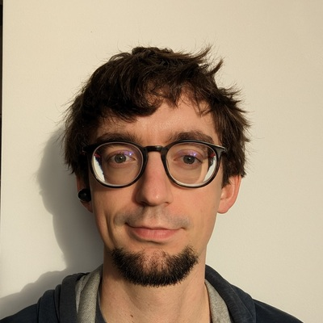
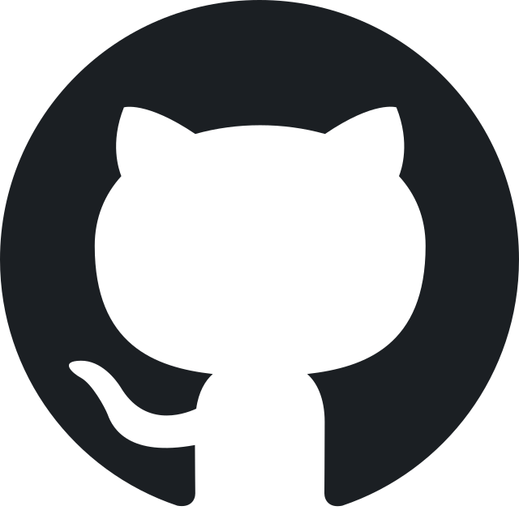

= Rust Software Engineer
Maciej Flak

[.info]
== !

=== Maciej Flak

[contact]
:hide-uri-scheme:
- image:location.png[role="picto"] Gliwice, Poland
//- image:phone.svg[role="picto phone"] +48 ...
- image:mail.svg[role="picto"] coder@flakm.com
-  https://github.com/FlakM
- image:www.svg[role="picto"] https://flakm.com

=== !
[atouts]
* Autonomy
* Communication
* Problem-solving

==== Competences

- Mastery in debugging difficult problems
- Linux/NixOS
- System performance tuning
- Providing high availability
- Fighting technical debt

==== My values

- Curiosity
- Optimism
- Rigor

==== Interests

- Gravel cycling
- Self-hosting
- Embedded toys on RP2040

[.chronologie]
== !

=== Experience
[.heading]

==== 2023 - 2025 : Rust Software Engineer
*Modivo*

- Led backend development for mission-critical services using Rust
- Optimized system performance and reduced latency of critical paths
- Introduced observability practices using prometheus, open telemetry and grafana
- Redesign CI/CD pipelines, adopting a shift-left approach
- Migrated services to Kubernetes with zero downtime

==== 2023 : Scala Software Engineer
*Flo Health*

- Designed and maintained high-traffic services using Scala on AWS
- Developed shared Rust libraries to implement state-of-the-art privacy practices
- Created bindings in platform-specific languages for seamless integration
- Implemented complex changes in a polyglot system serving millions of active users

==== 2019 - 2023 : Scala Software Engineer
*Ravenetics*

- Architected, developed, and maintained a full-scale AI chat agent system from the ground up
- Designed and implemented a custom programming language to enhance chatbot capabilities
- Developed and executed customer deployment strategies
- Built and optimized front and backend services with real-time communication
- Trained and fine-tuned machine learning models for improved chatbot performance
- Collaborated with customers to ensure smooth implementation, and system maintenance
- Strategized and optimized data persistence using PostgreSQL and CockroachDB

==== 2015 - 2019 : Software Engineer & IT designer
*ING Bank*

- Contributed to the migration of the core banking system for card payments
- Developed and implemented DevOps practices to improve productivity
- Designed and maintained internal tools for system monitoring and operational efficiency
- Contributed to the strategies to enhance system uptime and reliability

=== Education
[.heading]

==== 2015 – 2017 : Computer Science, Master’s Degree
University of Economics in Katowice

==== 2012 – 2015 : Computer Science, Bachelor’s Degree
University of Economics in Katowice

==== 2011 – 2014 : Finance and Accounting, Bachelor’s Degree
University of Economics in Katowice
